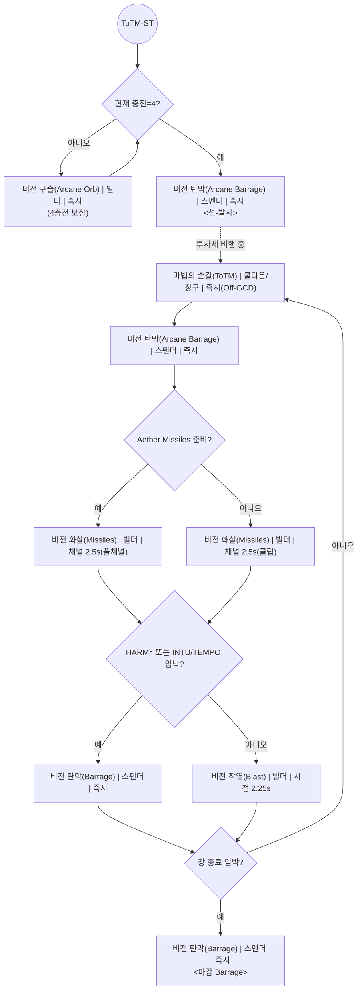
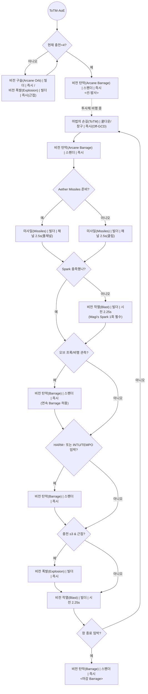

# 05 — ToTM-Window (마법의 손길 전용 스크립트)

> 대상: **WoW 11.2 · 비전 법사(Arcane) · Sunfury · Mythic+**  
> 목적: **마법의 손길(Touch of the Magi, 이하 ToTM)** 창에서 **누적 피해 극대화**를 위해 꼭 지켜야 할 **선-적중(Pre-Hit) 규칙**, **마감 Barrage**, **(AoE) Spark용 Blast 1회**를 **표/플로우**로 표준화한다.

---

## 1) 배경 · 구성 목적

- **왜**: ToTM 12초 동안의 누적/폭발 구조는 **Barrage의 투사체 비행시간**과 **Off-GCD ToTM**의 결합으로 **선-적용**을 강제한다. 이 한 동작이 **창 총 피해의 상한**을 결정한다.
- **무엇을**: **ST/AoE 각 창 스크립트**와 **예외 분기**(충전·프록·거리)까지 **관계형 표 + Mermaid**로 운용 절차를 고정한다.
- **불변 규칙**  
  1) **Barrage 발사 → (비행 중) ToTM(Off-GCD) → Barrage**. (*첫 Barrage는 ToTM 적용 전/후 모두 집계되도록 선-적중*)  
  2) **창의 마지막 GCD는 Barrage**.  
  3) **(AoE) ToTM 창 안에 Blast 1회** 포함(Magi’s Spark 충족).  
  4) **Aether Missiles만 풀 채널**, 그 외 Missiles는 **클리핑** 기본.

---

## 2) 본 문서에서 사용하는 스킬(블록 표기)

> 형식: `한글 스킬명 (영문명) | 성격 | 시전시간`

| ID | 스킬 블록 | 비고 |
|---:|---|---|
| S_TOTM | **마법의 손길 (Touch of the Magi) \| 쿨다운/창구 \| 즉시(Off-GCD)** | **Barrage 명중 전** 사용 |
| S_BARR | **비전 탄막 (Arcane Barrage) \| 스펜더 \| 즉시** | 원칙: **4충전** (Tempo 예외 문서별 참조) |
| S_MISS | **비전 화살 (Arcane Missiles) \| 빌더 \| 채널 2.5s** | **Aether만 풀 채널**, 그 외 **클립** |
| S_BLAS | **비전 작열 (Arcane Blast) \| 빌더 \| 시전 2.25s** | **(AoE) ToTM 창 내 1회 필수** |
| S_ORB  | **비전 구슬 (Arcane Orb) \| 빌더 \| 즉시** | 충전<3일 때 4충전 보장 빌더 |
| S_EXPL | **비전 폭발 (Arcane Explosion) \| 빌더 \| 즉시** | (근접) 충전 0~1(ST)/~3(AoE) 채움 |

**상태 키**: `CH`(현재 충전), `AETH`(Aether Missiles 준비), `HARM`(Harmony 스택), `INTU/TEMPO`(Intuition/Arcane Tempo 만료 임박), `SPARK_NEED`(Magi’s Spark 미충족), `EXEC_TRUE`(처형 구간).

---

## 3) ToTM — 단일 대상(ST) 전용 스크립트

### 3.1 단계 테이블(ST)

| ORDER | PRI | COND_KEY | HUMAN_COND | ACTION_SKILL | NOTES |
|---:|---:|---|---|---|---|
| 1 | 1 | CH_LT_4_BUILD | 4충전 미만 | **비전 구슬(Arcane Orb) \| 빌더 \| 즉시** / (원거리) **미사일(클립)** | 4충전 보장 후 진행 |
| 2 | 1 | PREHIT_BARR | 4충전 확보 | **비전 탄막(Arcane Barrage) \| 스펜더 \| 즉시** | **선-발사**로 투사체 비행 개시 |
| 3 | 1 | TOUCH_OFFGCD | *Barrage 명중 전* | **마법의 손길(ToTM) \| 쿨다운/창구 \| 즉시(Off-GCD)** | **선-적중(Pre-Hit) 규칙** |
| 4 | 2 | OPEN_BARR_POST | ToTM 진입 직후 | **비전 탄막(Barrage) \| 스펜더 \| 즉시** | 초반 2타 형성 |
| 5 | 3 | AETH_DECIDE | Aether 준비? | **미사일(Missiles) \| 채널(풀채널/클립)** | Aether=풀채널, else=클립 |
| 6 | 4 | HARM_OR_INTU | HARM↑ 또는 INTU/TEMPO 임박 | **비전 탄막(Barrage) \| 스펜더 \| 즉시** | 만료/고중첩 반응 |
| 7 | 5 | FILL_BLAST | 위 조건 모두 X | **비전 작열(Blast) \| 빌더 \| 시전 2.25s** | NP 소비/채움 |
| 8 | 6 | ENDING_BARR | 창 종료 임박(마지막 GCD) | **비전 탄막(Barrage) \| 스펜더 \| 즉시** | **마감 Barrage** (필수) |

### 3.2 ST 플로우(복붙용)

---

## 4) ToTM — 광역(AoE) 전용 스크립트

> **차이점**: AoE에서는 **NP는 Barrage 결정 영향이 작음**, 대신 **오브/프록 반응**이 핵심. 또한 **Magi’s Spark 충족을 위해 창 안에 Blast 1회 필수**.

### 4.1 단계 테이블(AoE)

| ORDER | PRI | COND_KEY        | HUMAN_COND              | ACTION_SKILL                                                                 | NOTES               |
| ----: | --: | --------------- | ----------------------- | ---------------------------------------------------------------------------- | ------------------- |
|     1 |   1 | CH_LT_4_BUILD   | 4충전 미만                 | **비전 구슬(Arcane Orb) \| 빌더 \| 즉시** / (근접) **익스플로전(Explosion)**   | 4충전 확보              |
|     2 |   1 | PREHIT_BARR     | 4충전 확보                 | **비전 탄막(Barrage) \| 스펜더 \| 즉시**                                        | 선-발사                |
|     3 |   1 | TOUCH_OFFGCD    | *Barrage 명중 전*         | **마법의 손길(ToTM) \| 즉시(Off-GCD)**                                         | 선-적중               |
|     4 |   2 | OPEN_BARR_POST  | ToTM 진입 직후             | **비전 탄막(Barrage) \| 스펜더 \| 즉시**                                        | 초반 2타               |
|     5 |   3 | AETH_DECIDE     | Aether 준비?             | **미사일(Missiles) \| 채널(풀채널/클립)**                                         | Aether=풀, else=클립    |
|     6 |   4 | SPARK_NEED      | Spark 미충족              | **비전 작열(Blast) \| 빌더 \| 시전 2.25s**                                       | 창 내 1회 필수           |
|     7 |   5 | ORB_IN_AIR      | 오브 프록/비행 관측            | **비전 탄막(Barrage) \| 스펜더 \| 즉시**                                        | 연속 Barrage 허용        |
|     8 |   6 | HARM_OR_INTU    | HARM↑ 또는 INTU/TEMPO 임박 | **비전 탄막(Barrage) \| 스펜더 \| 즉시**                                        | 만료/고중첩 반응         |
|     9 |   7 | FILL_EXP        | 충전≤3, 근접 가능            | **비전 폭발(Explosion) \| 빌더 \| 즉시**                                         | 최대 3충전까지 채움       |
|    10 |   8 | FILL_BLAST      | 그 외                    | **비전 작열(Blast) \| 빌더 \| 시전 2.25s**                                       | 기본 채움               |
|    11 |   9 | ENDING_BARR     | 창 종료 임박                | **비전 탄막(Barrage) \| 스펜더 \| 즉시**                                        | 마감 Barrage            |

### 4.2 AoE 플로우(복붙용)

---

## 5) 예외/분기 규칙(요약 표)

| 키                  | 상황            | 처리                                        |
| ------------------ | ------------- | ----------------------------------------- |
| `INTU/TEMPO` 만료 임박 | 창 도중 만료 직전    | **즉시 Barrage**(필요 시 0충전 예외)               |
| `HARM` 고중첩(≈12+)   | 창 도중 누적 높음    | **Barrage 우선**                            |
| `AETH` 준비          | ToTM 초/중반     | **해당 Missiles만 풀 채널**, 이후 **NP 소모 연계**    |
| `ORB_IN_AIR`       | 오브 프록/비행 관측   | **직접 Orb 지연**, **연속 Barrage**로 충전 손실 방지   |
| `SPARK_NEED`(AoE)  | 창 중 Spark 미충족 | **Blast 1회**를 창 안에 반드시 포함                 |
| `EXEC_TRUE`(처형)    | 대상 처형 구간      | **마지막 NP에서도 Barrage 우선 빈도↑**(오버라이드 문서 참조) |

---

## 6) 타이밍 & 거리 가이드(실전 감각화)

- **선-적중(Pre-Hit)**: Barrage **발사 후 0.2\~0.8s 내**(거리·가속·핑에 의존)에 \*\*ToTM(Off-GCD)\*\*를 눌러 **명중 시점엔 ToTM이 이미 적용**되게 한다.
- **근접 마감**: 창 **마지막 Barrage**가 **폭발 판정에 포함**되도록, **필요 시 Blink로 근접**해 **투사체 비행시간을 단축**한다.
- **오브 관측**: **프록/비행 오브**를 눈으로 확인하고 **직접 Orb 사용을 늦춰** **연속 Barrage**를 우선한다.
- **클리핑 원칙**: **Aether Missiles만 풀 채널**, 그 외 Missiles는 **NP 부여용으로 틱 마감에 맞춰 즉시 큐**.

---

## 7) 실행 체크리스트

- [ ] **Barrage 선-발사 → (비행 중) ToTM(Off-GCD) → Barrage** 정확 실행.
- [ ] **창 종료 직전 Barrage 마감**.
- [ ] **(AoE) 창 내 Blast 1회** 포함(Spark).
- [ ] **Intuition/Tempo 만료 손실 0회**.
- [ ] **Aether Missiles만 풀 채널**, 그 외 Missiles는 **클립**.
- [ ] **오브 프록/비행** 관측 시 **연속 Barrage**로 충전 손실 없음.

---

## 8) 변경 이력

- **v1.0.0**: 초판 — ST/AoE 전용 스크립트/플로우, 선-적중·마감·Spark 규칙 고정.
