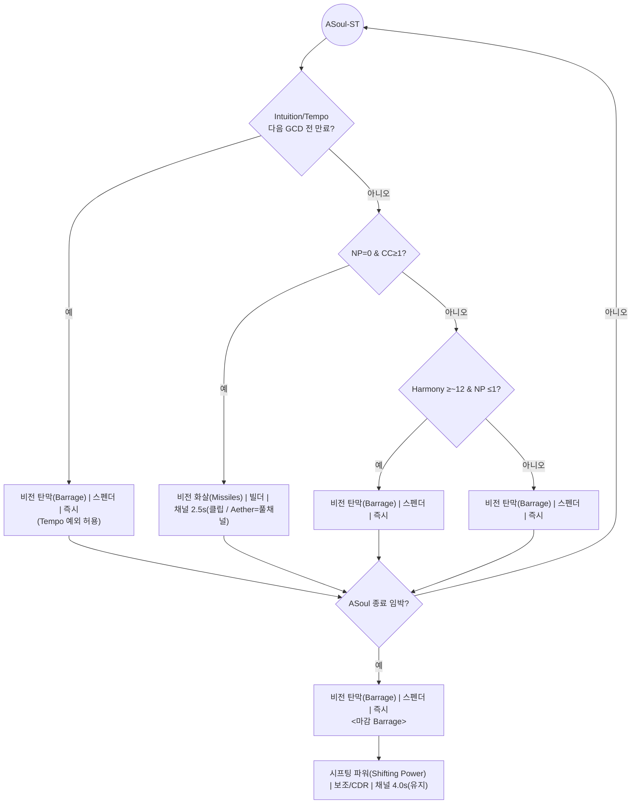
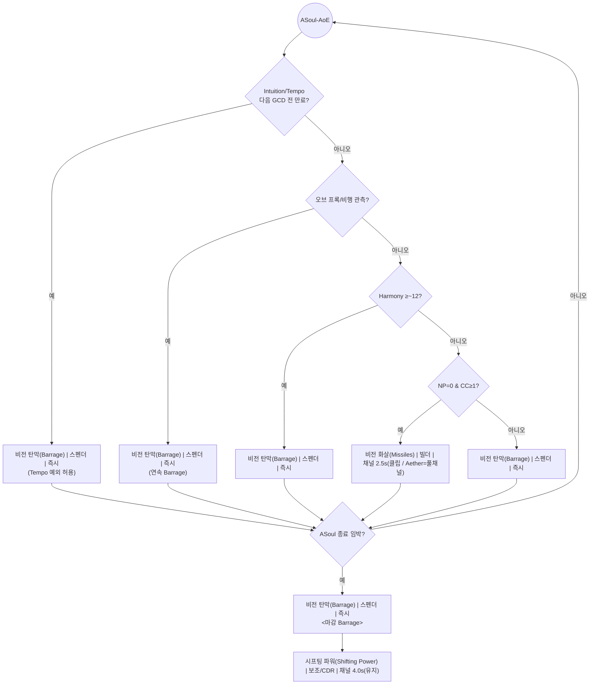

# 06 — Arcane-Soul-Window (Arcane Soul 서브루프)

> 대상: **WoW 11.2 · 비전 법사(Arcane) · Sunfury · Mythic+**  \
> 목적: **Arcane Surge 종료 직후** 발생하는 **Arcane Soul** 창에서 **바라지(Arcane Barrage) 연쇄**와 **버프 소모/유지**를 **거짓 없이** 실행하도록 표준 절차를 제공한다.

---

## 1) 배경 · 구성 목적

- **왜**: **Arcane Soul**(Sunfury — *Memory of Al’ar* 계열)은 Surge 종료 후 일정 시간 동안 **충전 소모 없이 연속 Barrage**를 허용하고, **Barrage마다 Clearcasting(=Missiles 사용권)**을 부여한다. 이 창을 올바르게 운용하면 **Tempo/Harmony 관리 + ToTM 누적 잔불**까지 한 번에 극대화된다.
- **무엇을**: **ST/AoE** 각각에 대해 **관계형 우선순위 표**와 **Mermaid 플로우**를 제공하고, **마지막 GCD는 Barrage** 규칙과 **창 종료 후 Shifting Power** 실행을 고정한다.
- **전제**: ToTM 창은 직전에 이미 수행되었을 가능성이 높다(오프너/미니고). **Arcane Soul 창 자체엔 Spark(Blast 1회) 의무 없음** — Spark 의무는 **ToTM 창 전용** 규칙.

---

## 2) 사용 스킬(블록 표기 규약)

> 형식: `한글 스킬명 (영문명) | 성격 | 시전시간`

| ID | 스킬 블록 | 핵심 포인트 |
|---:|---|---|
| S_BARR | **비전 탄막 (Arcane Barrage) \| 스펜더 \| 즉시** | Arcane Soul 중 **연속 사용 핵심**(충전 소모 예외 적용) |
| S_MISS | **비전 화살 (Arcane Missiles) \| 빌더 \| 채널 2.5s** | **Aether만 풀 채널**, 그 외 **클립**으로 **Nether Precision(NP)** 부여 |
| S_BLAS | **비전 작열 (Arcane Blast) \| 빌더 \| 시전 2.25s** | NP 소모/채움용 — **ASoul 창에선 비주류** |
| S_ORB  | **비전 구슬 (Arcane Orb) \| 빌더 \| 즉시** | 보충용(일반 루프). **ASoul 중 Barrage 연쇄가 우선** |
| S_SPWR | **시프팅 파워 (Shifting Power) \| 보조/CDR \| 채널 4.0s(유지)** | **Arcane Soul 종료 직후** 사용(고정) |

**상태 키**: `ASOUL`(Arcane Soul 활성), `NP`(Nether Precision), `CC`(Clearcasting), `AETH`(Aether Missiles 준비), `HARM`(Arcane Harmony), `INTU/TEMPO`(Intuition/Arcane Tempo 만료 임박), `TIME_LEFT`(Arcane Soul 남은 시간).

---

## 3) 공통 불변 규칙(ASoul)

1) **창의 마지막 GCD는 반드시 Barrage**로 마감.  
2) **NP=0 & CC≥1이면 Missiles(클립)**으로 **NP 부여 후 Barrage**. (*Aether*일 땐 **풀 채널**)  
3) **Intuition/Tempo 만료 임박** 시 **즉시 Barrage**(Tempo 예외 — 필요 시 **0충전 Barrage 허용**).  
4) **창 종료 직후** **Shifting Power 채널**로 대쿨 회전.  
5) **Spark(Blast 1회) 의무 없음** — Spark는 **ToTM 문서(05)** 규칙.

---

## 4) 단일 대상(ST) — Arcane Soul 우선순위

### 4.1 우선순위 테이블(ST)

| PRI | COND_KEY | HUMAN_COND | ACTION_SKILL | NOTES |
|---:|---|---|---|---|
| 1 | INTU_OR_TEMPO_EXP | **Intuition/Tempo**가 **다음 GCD 전 만료** | **비전 탄막(Barrage) \| 스펜더 \| 즉시** | **Tempo 예외 허용(0충전 가능)** |
| 2 | NP_EQ_0_AND_CC_GE_1 | **NP=0 & CC≥1** | **비전 화살(Missiles) \| 빌더 \| 채널 2.5s(클립)** | **NP 부여**(Aether는 풀 채널) |
| 3 | HARM_GE_12_AND_NP_LE_1 | **Harmony ≥~12 & NP ≤ 1** | **비전 탄막(Barrage) \| 스펜더 \| 즉시** | 고중첩 Barrage |
| 4 | ELSE_BARR | 그 외 전부(ASoul 유지 중) | **비전 탄막(Barrage) \| 스펜더 \| 즉시** | **연속 Barrage 기본값** |
| 5 | ENDING_GCD | **Arcane Soul 종료 임박** | **비전 탄막(Barrage) \| 스펜더 \| 즉시** | **마감 Barrage**(필수) |
| 6 | AFTER_ASOUL | **Arcane Soul 종료 직후** | **시프팅 파워(Shifting Power) \| 보조/CDR \| 채널 4.0s(유지)** | 창 종료 후 고정 |

### 4.2 ST 플로우(복붙용)

---

## 5) 광역(AoE) — Arcane Soul 우선순위

> **차이점**: AoE에선 **NP는 Barrage 결정에 영향이 거의 없음**. **오브 프록/비행**을 관측하면 **직접 Orb 지연** + **Barrage 연속**으로 충전 손실을 막는다(ASoul 중엔 어차피 연쇄가 기본).

### 5.1 우선순위 테이블(AoE)

| PRI | COND_KEY                 | HUMAN_COND                            | ACTION_SKILL                                       | NOTES                         |
| --: | ------------------------ | ------------------------------------- | -------------------------------------------------- | ----------------------------- |
|   1 | INTU_OR_TEMPO_EXP       | **Intuition/Tempo**가 **다음 GCD 전 만료** | **비전 탄막(Barrage) \| 스펜더 \| 즉시**             | **Tempo 예외 허용**              |
|   2 | ORB_IN_AIR              | **오브 프록/비행 관측**                      | **비전 탄막(Barrage) \| 스펜더 \| 즉시**             | **연속 Barrage**로 충전 손실 방지 |
|   3 | HARM_GE_12              | **Harmony ≥~12**                        | **비전 탄막(Barrage) \| 스펜더 \| 즉시**             | 고중첩 소모                      |
|   4 | NP_EQ_0_AND_CC_GE_1     | **NP=0 & CC≥1**                         | **비전 화살(Missiles) \| 빌더 \| 채널 2.5s(클립)**    | NP 부여(필요 시)                 |
|   5 | ELSE_BARR               | 그 외 전부(ASoul 유지 중)                   | **비전 탄막(Barrage) \| 스펜더 \| 즉시**             | **연속 Barrage 기본값**          |
|   6 | ENDING_GCD              | **Arcane Soul 종료 임박**                  | **비전 탄막(Barrage) \| 스펜더 \| 즉시**             | **마감 Barrage**                 |
|   7 | AFTER_ASOUL             | **Arcane Soul 종료 직후**                  | **시프팅 파워(Shifting Power) \| 보조/CDR \| 채널 4.0s(유지)** | 창 종료 후 고정                  |

### 5.2 AoE 플로우(복붙용)

---

## 6) 세부 운용 메모

- **Barrage 연쇄가 기본**: Arcane Soul 동안은 **Barrage→(CC 획득)→필요 시 Missiles(클립)로 NP 부여→Barrage** 흐름을 빠르게 반복한다.
- **Harmony 동기화**: **HARM이 높을수록 Barrage 가치가 급상승** — 연쇄 내에서도 우선 적용.
- **Tempo 예외**: **Arcane Tempo** 만료 직전에는 **0충전 Barrage로도 갱신** 허용(창 유지력 우선).
- **ASoul 종료 감지**: 남은 시간이 **1GCD 이하**로 줄어들면 **즉시 Barrage 마감**을 준비한다(거리·핑 고려).

---

## 7) 실행 체크리스트

- [ ] **ASoul 내 기본은 Barrage 연쇄**, **NP=0 & CC≥1**이면 **Missiles(클립)**으로 NP 부여 후 Barrage.
- [ ] **Intuition/Tempo 만료 손실 0회**(필요 시 0충전 Barrage 허용).
- [ ] **Harmony 고중첩**에서 **Barrage 지연 없음**.
- [ ] **Aether Missiles만 풀 채널**.
- [ ] **ASoul 마지막 GCD는 Barrage**, **종료 직후 Shifting Power** 채널.

---

## 8) 변경 이력

- **v1.0.0**: 초판 — ST/AoE Arcane Soul 우선순위·플로우, 마감/사후 CDR 규칙 고정.
