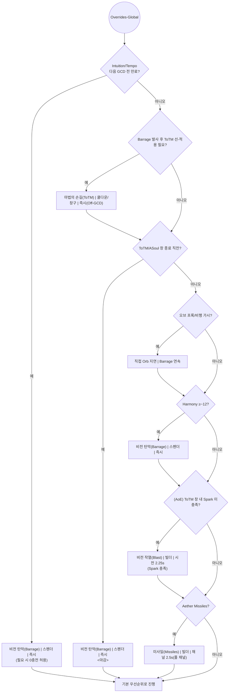
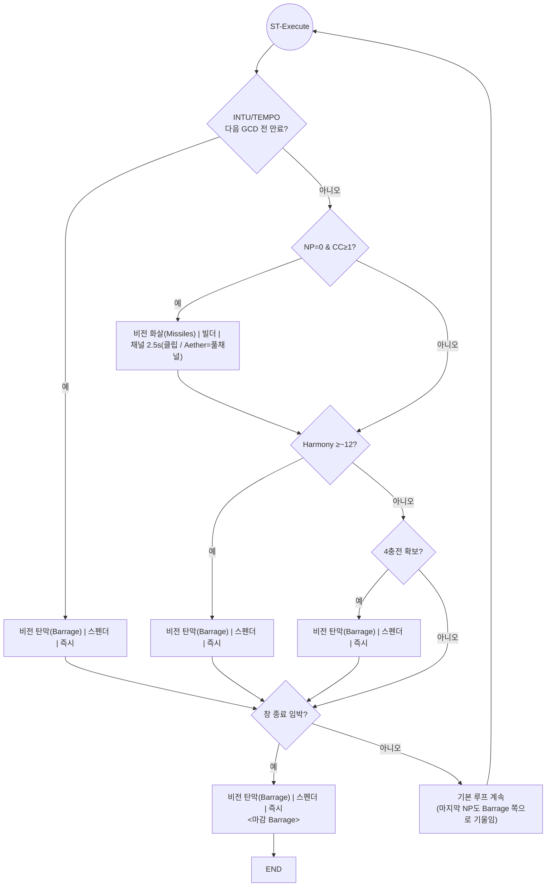
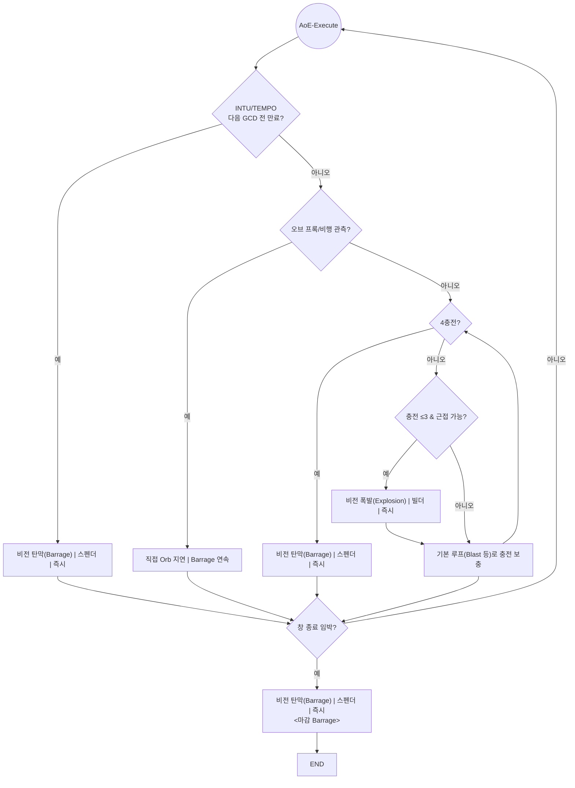

# 07 — Edge-Cases-and-Exec-Rules (예외/처형/반응형 규칙)

> 대상: **WoW 11.2 · 비전 법사(Arcane) · Sunfury · Mythic+**  
> 목적: **딜 사이클의 예외 분기/처형(Execute)/프록 반응/거리·투사체 테크닉**을 표준화하여 **거짓 없이 재현**하도록 한다.  
> 원칙 요약: **선-적중 Touch**, **마감 Barrage**, **Tempo·Intuition 만료 최우선**, **오브(Orb) 비행/프록 관측 후 연속 Barrage**, **(AoE) Touch 창 내 Blast 1회**.

---

## 1) 분류(What is “Edge/Exec”)

- **Exec(처형)**: 보스/정예의 **체력 임계**(던전별 상이, 일반적으로 **30% 전후**)에 진입해 **Barrage 우선 빈도**가 **정상 루프보다 높아지는** 구간.
- **Orb/프록 반응형**: **오브 바라지(Orb Barrage)** 프록 또는 **투사체 비행 중 오브**가 **충전을 복원**할 것이 확실할 때 **직접 Orb 사용을 보류**하고 **Barrage 연속**으로 이득을 취하는 상황.
- **거리·투사체 테크닉**: **Barrage 비행시간**, **Missiles 틱/여행시간**을 이용해 **Touch 선-적용, ‘Gucci Missiles’(미사일→즉시 Barrage로 공중 틱으로 충전 복원)** 등을 성사시키는 조작.
- **CD 동기/비동기**: **Surge/Touch/Evocation**의 **동기(send together) vs 분리(send on CD)** 의사결정.

---

## 2) 공통 오버라이드 매트릭스(우선순위 강제 규칙)

| 우선 | 트리거 키 | 사람이 읽는 조건 | 즉시 행동 | 적용 범위 |
|---:|---|---|---|---|
| 1 | **INTU/TEMPO_EXP** | **Intuition 또는 Arcane Tempo**가 **다음 GCD 전 만료** | **비전 탄막 (Arcane Barrage) \| 스펜더 \| 즉시** *(필요 시 0충전 허용)* | ST/AoE/ASoul/ToTM 전 구간 |
| 2 | **PREHIT_TOTM** | **Barrage 발사 직후, 명중 전** | **마법의 손길 (Touch of the Magi) \| 쿨다운/창구 \| 즉시(Off-GCD)** | 모든 ToTM 진입 |
| 3 | **END_WINDOW** | **ToTM / Arcane Soul** **종료 직전 마지막 GCD** | **비전 탄막 (Arcane Barrage) \| 스펜더 \| 즉시** | 창 마감 공통 |
| 4 | **ORB_IN_AIR** | **오브 프록/비행 가시** | **직접 Orb 사용 보류**, **Barrage 연속** | 주로 AoE/ASoul |
| 5 | **HARM_12P** | **Arcane Harmony ≥ ~12** | **비전 탄막(Barrage)** 우선 | ST/AoE 공통 |
| 6 | **SPARK_NEED** | **(AoE) ToTM 창 내 Magi’s Spark 미충족** | **비전 작열 (Arcane Blast) \| 빌더 \| 시전 2.25s** 1회 포함 | AoE ToTM |
| 7 | **AETH_ONLY_FULL** | **Aether Missiles** | **미사일(Missiles) 풀 채널**, 그 외 **클립** | 전 구간 |

> 위 **오버라이드**는 **기본 우선순위 테이블**보다 **항상 우선** 적용.

### 2.1 오버라이드 플로우(복붙용)

---

## 3) 처형(Execute) 규칙 — ST & AoE

### 3.1 ST Execute 핵심

- **마지막 NP 소모 시점**: 처형 중에는 **Aether 보유 여부에 덜 의존**. **NP 마지막 1스택**이라도 **Barrage** 쪽으로 **기울여 사용**(누적 폭발 극대화).
- **ToTM 종료 Barrage 착탄**: **Barrage가 ToTM 폭발 전에 “착탄”**하도록 **거리 조절**. 원거리일수록 비행시간이 길어 **착탄 지연** → **Blink**로 **근접/시전 후 즉착**.
- **미사일 처리**: **Aether**만 풀 채널, 그 외엔 **클립**으로 **NP 보강 후 Barrage**.

#### 3.1 ST Execute 플로우(복붙용)

### 3.2 AoE Execute 핵심

- **4충전 고정 Barrage**: **4충전이면 NP 무시**하고 **Barrage** (Tempo/Intuition/하모니 조건이 겹치면 더욱 우선).  
- **Explosion 범위 충전**: **0~3충전 구간**은 **폭발(Explosion)로 채움**(근접 시).  
- **오브 반응**: **오브 프록/비행**을 관측한 경우 **직접 Orb 사용 보류** → **Barrage 연속**으로 충전 손실 없이 뎀증.

#### 3.2 AoE Execute 플로우(복붙용)

---

## 4) 오브/프록 반응 규칙(상세)

| 상황 | 관측 신호 | 행동 | 이유 |
|---|---|---|---|
| **오브 프록** | Barrage 직후 **오브가 생성/비행** | **연속 Barrage** (충전 0~1이어도) | 오브 적중 시 **충전 즉시 복원** → GCD 손실 없이 **딜 연속** |
| **오브 재사용 임박** | 쿨타임 **곧 완료** | **(4충전) Blast 1~2회 후 Orb** | 오버/낭비 방지 + Spark/주기 정렬 |
| **Intuition 3s 내 만료** | 직감 아이콘 **점멸/수초 잔여** | **즉시 Barrage** | **강화 Barrage + 환급**을 놓치지 않기 위함 |

---

## 5) 거리·투사체 테크닉

### 5.1 Touch 선-적중(Pre-Hit)

- **절차**: **Barrage 발사 → (0.2~0.8s) Touch(Off-GCD)** → **Barrage 착탄**.  
- **목표**: **첫 Barrage 피해 일부도 ToTM 누적에 포함** + **즉시 2타 구조**(착탄 직후 Barrage 추가).

### 5.2 ‘Gucci Missiles’

- **개념**: **Missiles 채널 틱이 공중에 있는 동안** **바로 Barrage**를 눌러, **Missiles 남은 틱으로 충전이 복원**되게 만드는 연계.  
- **주의**: **Aether 외 Missiles는 클립**이 기본. **Barrage는 4충전 원칙**을 가능하면 유지하되, **Missiles 공중 틱**으로 **즉시 4복원**이 확실할 때만 예외처럼 사용.

### 5.3 Orb 비행시간 연계

- **원거리에서 오브 발사 후** **오브가 팩 중앙을 통과하는 타이밍**에 **Barrage 연속 입력** → **오브 적중과 동시에 4충전 복구** → **GCD 손실 없이 2~3연속 Barrage**.

> *고급*: **7–10 Split**(8+ 대상) — 하나의 오브로 **다중 완충 Barrage** 확보. 난이도 높음(팩의 뭉침도·거리·가속 의존).

---

## 6) 쿨다운(CD) 동기/비동기 가이드

| 상황 | 권장 | 이유/메모 |
|---|---|---|
| **일반 M+ 진행** | **Send on CD**: **Surge → (4충전) Barrage → (비행 중) Touch → Barrage**, 직후 **Shifting Power** | 평균적으로 **총 사용 횟수↑**가 **총 피해↑**에 직결 |
| **잡몹 웨이브-보스 연계(광폭/특수)** | **Touch/Surge 재정렬**(Hold) **단, 사용 횟수 손실 없음이 확실할 때만** | **한 번의 Hold로 Surge 사용 1회 손실**이면 총합 손해 |
| **Touch만 준비, Surge/Evo 10~20s 남음** | **Touch 먼저 사용**, 다음 웨이브에서 **Surge/Evo와 재동기** | **주기 손실 최소화** |
| **Touch ≤6s, Glorious Incandescence 보유** | **GI 보유한 상태로 Touch 대기** | **GI+ToTM 결합 가치↑** |

---

## 7) 이동·환경 최적화

| 기법 | 입력/조건 | 결과 |
|---|---|---|
| **Shimmer-Channel** | **미사일/시프팅 파워 채널 중 Shimmer** | **채널 유지+미세 포지셔닝**로 **딜로스 0** 이동 |
| **Knockback 면역 창구** | **시전 시작 → Knock 직전 Shimmer → Knock 직후 Shimmer** | **시전 끊김 없이** 밀쳐내기 통과 |
| **Evocation 이동** | 기본은 **이동 시 채널 중단**, **Slipstream 특성**이면 **이동 캐스팅 가능** | **프리채널 안전성↑** |

---

## 8) Spell Queue Window(SQW) 권장

- **권장 값**: **≈300ms**(빠른 입력 선호자 기준).  
- **의미**: **다음 주문을 미리 큐**해 **GCD 경계에서 손실(Gap)**을 최소화.  
- **체크**: 전투 로그/리플레이에서 **GCD 간 간격**이 **일관되게 최소**인지 확인.

---

## 9) 실패-복구(Graceful Degrade)

| 실패 | 즉시 조치 | 다음 단계 |
|---|---|---|
| **마나 고갈(OOM)** | **비전 탄막(Barrage)** 즉시 | **비전 구슬(Orb)**로 충전 복원 → **루프 재개** |
| **NP 과충전(겹침)** | **Blast/Barrage로 즉시 소모** | **Missiles는 Aether만 풀채널** 원칙 회복 |
| **Touch 선-적중 실패** | **다음 GCD Barrage로 보정** | **거리 단축( Blink )** + **다음 창에서 재시도** |

---

## 10) 마이크로 스크립트(암기용)

### 10.1 ST Execute(요약)

1) **(가능하면) 4충전** 확보 → **Barrage**  
2) **NP=0 & CC≥1**이면 **Missiles(클립)** → **Barrage**  
3) **HARM≥~12** 또는 **INTU/TEMPO 만료 임박**이면 **즉시 Barrage**  
4) **ToTM 종료 직전** **근접/즉착 Barrage**로 마감

### 10.2 AoE Execute(요약)

1) **4충전**이면 **NP 무시**하고 **Barrage**  
2) **0~3충전**은 **Explosion**으로 채움(근접)  
3) **오브 프록/비행** 보이면 **직접 Orb 보류** → **Barrage 연속**  
4) **ToTM 창 내 Blast 1회**(Spark) → **마감 Barrage**

---

## 변경 이력

- **v1.0.0**: 초판 — 공통 오버라이드·Execute·오브 반응·거리/투사체 테크·CD 동기·복구 시나리오 정리.
